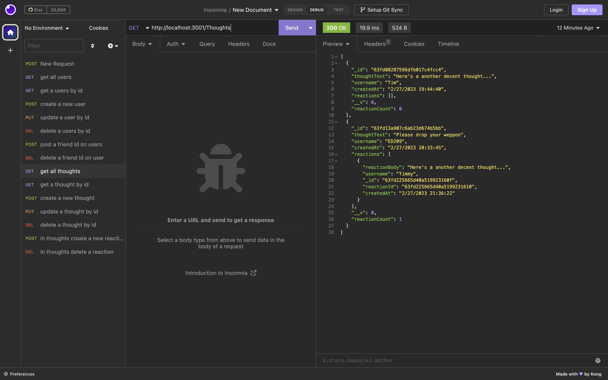

# Social-Network-API
API for a social network web application where users can share their thoughts, react to friends’ thoughts, and create a friend list.

## Description
This server-side application that demonstrates the ability to build routes and connect to the No-sql database.

There is no client-side user interface, it is only to demonstrate the ability build REST API's and use HTTP methods: GET, POST, UPDATE, DELETE and connect with the database using No-SQL.
A video link has been provide below showing the use of Imsomnia to test all the HTTP methods as discussed.

gitHub repo URL: https://github.com/Tomal1/Social-Network-API

Youtube video URL: 

## Usage
The user can use Imsomnia to test out the HTTP mettods as demonstrated in the video link found above.

## License

Please refer to the LICENSE in the repo.
